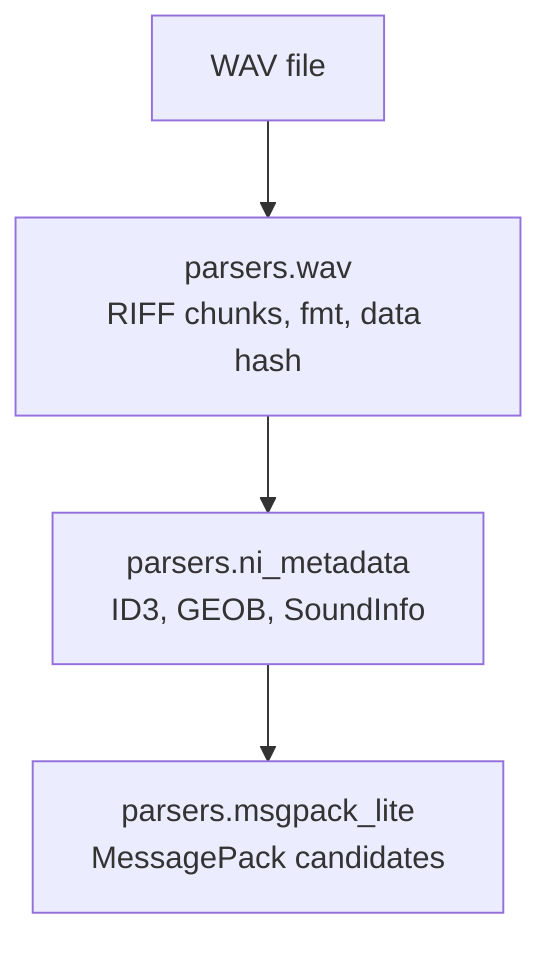

# Parser Layer

## Purpose

This package contains binary parsers used by scanning, indexing, and metadata extraction.

The parsers are intentionally separated by responsibility:

- `wav`: low-level RIFF/WAVE chunk iteration and audio identity extraction
- `ni_metadata`: Native Instruments metadata extraction from WAV metadata chunks
- `msgpack_lite`: small MessagePack decoder used by the NI metadata scanner

## RIFF/WAVE Layout

A valid WAV file starts with:

```text
RIFF <little-endian file size> WAVE
```

After that, the file contains a sequence of RIFF chunks:

```text
<4-byte chunk id> <4-byte little-endian size> <chunk payload> [pad byte if odd size]
```

Observed chunk IDs include:

| Chunk | Purpose |
| --- | --- |
| `fmt ` | Standard WAV audio format information |
| `data` | Audio payload |
| `ID3 ` | Embedded ID3v2 metadata; most relevant for NI tags |
| `fact` | Standard/non-PCM sample count metadata |
| `acid` | ACID loop metadata |
| `JUNK` | Padding/reserved data |
| `LIST` | RIFF list metadata, e.g. labels |
| `bext` | Broadcast WAV extension |
| `cue ` | Cue points |
| `LGWV` | Observed proprietary/vendor-specific waveform data |

## Parser Stack



## Read Strategy

The metadata scanner avoids reading the `data` chunk into memory. The database indexer streams that chunk through SHA-256 and returns as soon as `fmt ` and `data` have been read, so exotic metadata chunks after the audio payload do not block audio-content indexing.

Detailed parser documentation lives next to each implementation:

- [`wav/README.md`](wav/README.md)
- [`ni_metadata/README.md`](ni_metadata/README.md)
- [`msgpack_lite/README.md`](msgpack_lite/README.md)
