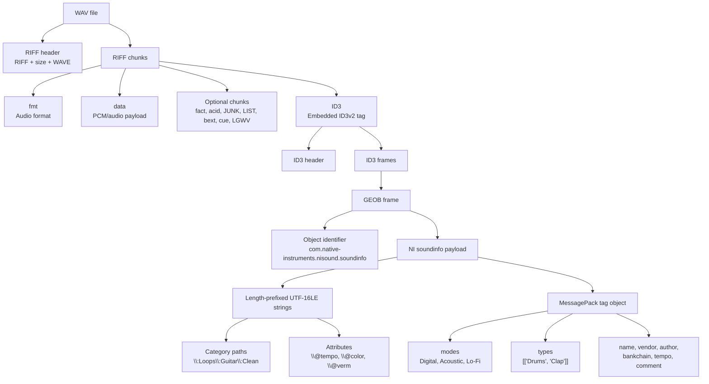

# NI Metadata Parser

## Purpose

This package contains parsers for Native Instruments metadata embedded in WAV files. It focuses on the metadata structures observed in NI sample libraries, especially ID3 chunks, GEOB frames, NI SoundInfo payloads, and MessagePack-like tag candidates.

The public import surface is re-exported from `__init__.py`, so callers can use:

```python
from sampletagharmonizer.parsers.ni_metadata import inspect_wav, parse_geob_frame
```

## Structure

- `models.py`: typed domain objects used by the NI metadata parser.
- `id3.py`: low-level ID3 frame parsing helpers.
- `soundinfo.py`: GEOB and NI SoundInfo extraction.
- `scanner.py`: high-level WAV inspection and MessagePack candidate discovery.

## High-Level Layout

NI sample metadata is stored inside normal RIFF/WAVE files. The audio data stays in the usual `data` chunk, while tag metadata is stored in additional chunks, most importantly an `ID3 ` RIFF chunk.



## ID3 Layer

NI metadata has been observed inside an `ID3 ` RIFF chunk. The payload begins with an ID3 header:

```text
ID3 <version> <flags> <synchsafe tag size>
```

Inside the ID3 tag, the currently relevant frame is:

```text
GEOB
```

`GEOB` is a general encapsulated object frame. In the observed files, NI uses it to store `com.native-instruments.nisound.soundinfo`.

Important detail: some files do not put the NI identifier into the standard GEOB MIME field. Instead, the scanner searches the complete GEOB frame for:

```text
com.native-instruments.nisound.soundinfo\0
```

Everything after this marker is treated as the NI soundinfo payload.

## Synchsafe Integer

`_synchsafe_to_int()` dekodiert eine **synchsafe integer** aus ID3-Tags.

Bei ID3v2 wird die Größe des gesamten Tags oft nicht als normaler 32-bit Integer gespeichert, sondern als 4 Bytes, bei denen pro Byte nur **7 Bits** Nutzdaten verwendet werden. Das höchste Bit jedes Bytes bleibt immer `0`.

Warum? Damit im ID3-Metadatenblock keine Byte-Muster entstehen, die ein MP3-Decoder fälschlich als Audio-Sync-Header interpretieren könnte. Daher "sync-safe".

Die Funktion:

```python
def _synchsafe_to_int(raw: bytes) -> int:
    value = 0
    for byte in raw:
        value = (value << 7) | (byte & 0x7F)
    return value
```

macht pro Byte:

1. bisherigen Wert um 7 Bits nach links schieben
2. nur die unteren 7 Bits des aktuellen Bytes nehmen: `byte & 0x7F`
3. diese Bits an den Wert anhängen

Beispiel:

```text
raw = 00 00 02 10
```

wird nicht als normaler Big-Endian-Wert `528` gelesen, sondern als:

```text
0 << 7 | 0
0 << 7 | 0
0 << 7 | 2
2 << 7 | 16 = 272
```

In unserem Code brauchen wir das hier:

```python
tag_size = _synchsafe_to_int(data[6:10])
```

Das sind im ID3-Header die 4 Bytes für die Tag-Größe. Die Frame-Größen selbst scheinen bei NI dagegen teils normale Big-Endian-Größen zu sein, deshalb gibt es zusätzlich `_frame_size()`.

## Observed NI Payload Variants

Two useful variants have appeared so far.

### Variant A: MessagePack Tag Object

Some files contain a compact MessagePack object with clear tag fields:

```json
{
  "__ni_internal": {
    "source": "other"
  },
  "author": "Native Instruments",
  "bankchain": ["Chromatic Fire"],
  "comment": "",
  "modes": ["Digital"],
  "name": "Clap BlackEarth",
  "tempo": 0.0,
  "types": [["Drums", "Clap"]],
  "vendor": "Native Instruments"
}
```

This confirms the finding from `docs/Reverse Engineering.xlsx`: bytes like `0xa8` are not category IDs. They are MessagePack string markers. For example:

```text
0xa8 Acoustic
```

means "fixed-length string with 8 bytes", followed by the UTF-8 string `Acoustic`.

Useful MessagePack markers:

| Marker | Meaning |
| --- | --- |
| `0x80`-`0x8f` | fixed-size map |
| `0x90`-`0x9f` | fixed-size array |
| `0xa0`-`0xbf` | fixed-size UTF-8 string |
| `0xcb` | 64-bit float |
| `0xdc` | array16 |
| `0xde` | map16 |

### Variant B: Length-Prefixed UTF-16LE Strings

Other files expose category and attribute information as length-prefixed UTF-16LE strings. A string is encoded as:

```text
<4-byte little-endian character count> <UTF-16LE string bytes>
```

Example decoded strings:

```text
Guitar[140] C GuitarSlim 1
Native Instruments
Native Instruments
Lilac Glare
\:Loops
\:Loops\:Guitar
\:Loops\:Guitar\:Clean
\@color
0
\@devicetypeflags
0
\@soundtype
0
\@tempo
0
\@verl
1.7.12
\@verm
1.7.12
\@visib
0
```

The scanner summarizes these as:

```json
{
  "title": "Guitar[140] C GuitarSlim 1",
  "vendor": "Native Instruments",
  "product": "Lilac Glare",
  "category_paths": [
    ["Loops"],
    ["Loops", "Guitar"],
    ["Loops", "Guitar", "Clean"]
  ],
  "attributes": {
    "color": "0",
    "devicetypeflags": "0",
    "soundtype": "0",
    "tempo": "0",
    "verl": "1.7.12",
    "verm": "1.7.12",
    "visib": "0"
  }
}
```

## Scanner Output Model

`sth scan` currently emits one JSON report with this shape:

```text
dataset_path
scanned_files
reported_files
errors[]
files[]
  path
  chunks[]
    chunk_id
    offset
    size
  id3_frames[]
    frame_id
    offset
    size
    geob?
      encoding
      mime
      object_id
      payload_size
      summary
      utf16le_strings[]
  ni_soundinfo[]
  msgpack_candidates[]
    chunk_id
    chunk_offset
    offset
    consumed
    value
```

Example command:

```bash
sth scan --limit 20 --only-hits --pretty
```

## Current Interpretation

The important working hypothesis is:

1. NI category names are stored as text, not as opaque category IDs.
2. MessagePack `modes` and `types` are the cleanest source when present.
3. UTF-16LE `\:...` paths are another category representation, probably used by a different NI product/version/export path.
4. Writing support should preserve the exact existing container structure for the file variant being edited.

The project should remain read-only until enough files have been scanned to verify which variant each NI product line uses.
